# Overview:

## A microservices-based architecture application is deployed on Kubernetes and there’s a need to create a clear IaaC (Infrastructure as Code) deployment to be able to deploy the services in a fast manner.

# Setup Details:

- Provision the Socks Shop example microservice application -
- https://github.com/microservices-demo/microservices-demo/tree/master

# Task Instructions:

- All deliverables need to be deployed using an Infrastructure as Code approach.
- In your solution please emphasize readability and maintainability (make yor application deployment clear)
- We expect a clear way to recreate your setup and will evaluate the project decisions based on:

> Deploy pipeline
>
> Metrics (Alertmanager)
>
> Monitoring (Grafana)
>
> Logging (Prometheus)
>
> - Use Prometheus as a monitoring tool
> - Use Ansible or Terraform as the configuration management tool.
> - You can use an IaaS provider of your choice.
> - The application should run on Kubernetes

---

# Microservice Application Deployment on Azure Kubernetes Service (AKS)

This project demonstrates a scalable and modular approach to deploying a microservice-based application using various Kubernetes tools, GitHub Actions for CI/CD, and infrastructure-as-code (IaC) practices.

## Project Overview

This repository automates the deployment of a microservice application (Sock Shop) on an Azure Kubernetes Service (AKS) cluster. The deployment includes monitoring and SSL/TLS security using industry-standard tools like Prometheus, Grafana, and Let's Encrypt.

### Key Features

- _Modular Microservice Deployment:_ Independently deploy and manage microservice components.
- _CI/CD Pipeline with GitHub Actions:_ Automate the provisioning of AKS and the deployment of applications.
- _Comprehensive Monitoring:_ Integrate Prometheus for monitoring and Grafana for visualization.
- _Secure Application Deployment:_ Use Nginx Ingress Controller and Let's Encrypt certificates for HTTPS.

## Tools Used

- _GitHub Actions:_ Automate AKS creation and application deployment.
- _Prometheus:_ Monitor and alert on application metrics.
- _Grafana:_ Visualize metrics with customizable dashboards.
- _Let's Encrypt:_ Automate SSL/TLS certificates for secure access.

## Project Structure

- _[infrastructure/](./infrastructure/):_ Terraform configurations for setting up the AKS cluster.
- _[sockshop-microservice/](./sockshop-microservice/):_ Kubernetes manifests for deploying the Sock Shop application and monitoring tools.
- _[k8s/](./kubernetes/ingress/):_ Ingress and Let's Encrypt configuration files for securing application access.

## Deployment Process

### 1. _Deploying the Sock Shop Application_

The Sock Shop is a sample microservice-based e-commerce application. It includes services such as the web front end, database, and backend logic.

Navigate to the ./infrastructure/ directory and run terraform
init and apply.

```
terraform init
```

```
terraform plan -out=tfplan
```

```
terraform apply tfplan
```

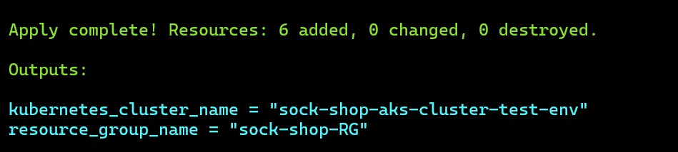

Then to deploy the application, navigate to the ./sockshop-microservices/ directory and apply the YAML files.

```
kubectl apply  -f .
```

or apply the manifest in the ./k8s directory

```
kubectl apply  -f sockshop-deployment.yaml
```

> Connect kubectl to cluster
> 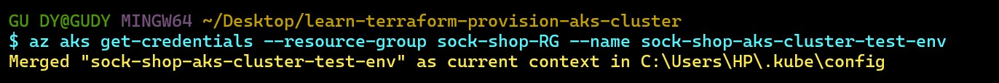

---

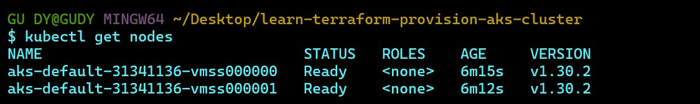
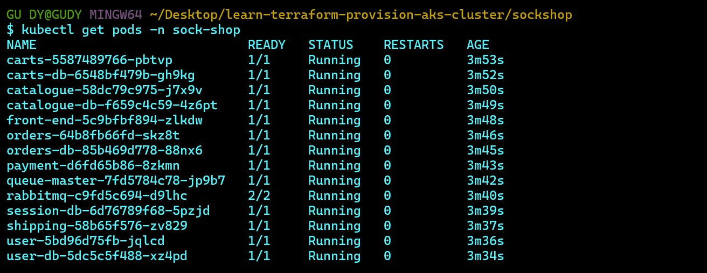

> Port-forwarding the frontend service
> 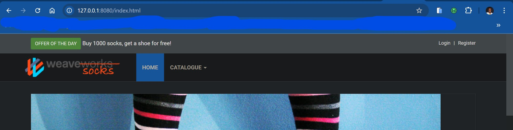

---

> Configured a loadbalancer service for the frontend before i using an ingress-nginx controller to route traffic to my application
> 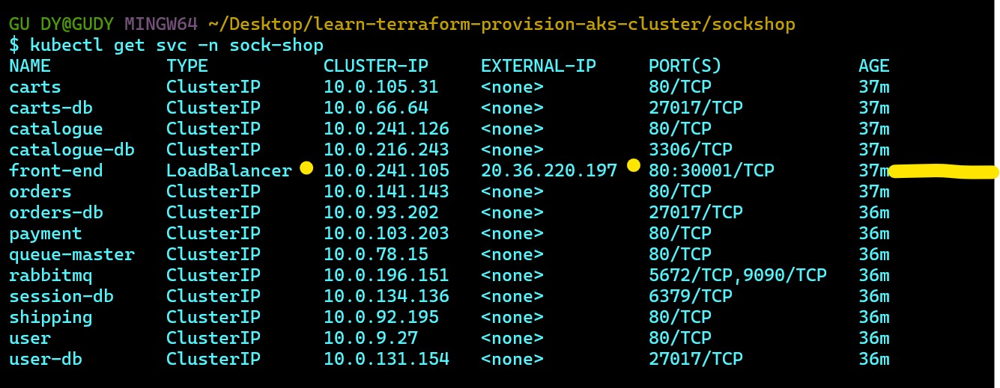 > 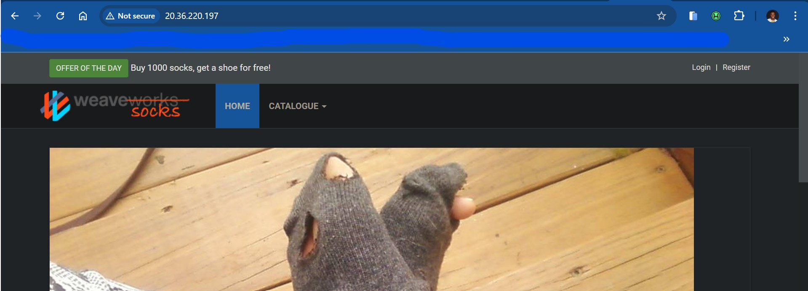

- i changed the service type back to ClusterIp

### 2. _Setting Up Ingress-Nginx Controller & Let’s Encrypt_

The Ingress-Nginx Controller acts as a reverse proxy and load balancer for routing external traffic to your services.

To enable HTTPS with Let's Encrypt:

- Install the Ingress-Nginx Controller [Quick Start Guide](https://kubernetes.github.io/ingress-nginx/deploy/#quick-start).
- Install Cert-Manager [Cert-Manager Installation](https://github.com/cert-manager/cert-manager/releases/tag/v1.15.2).
- Install Cert-Manager kubectl plugin.
- Create a ClusterIssuer for Let's Encrypt.
- Define ingress rules for your services.

> I issued a staging certificate first and you can find it in the ./k8s/isser-stag.yaml
> 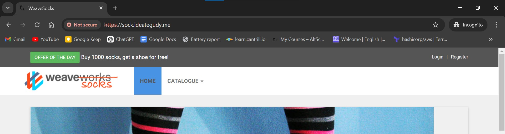

---

> This is the production certificate which is secured
> 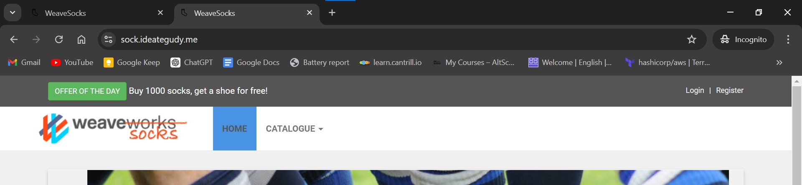 > 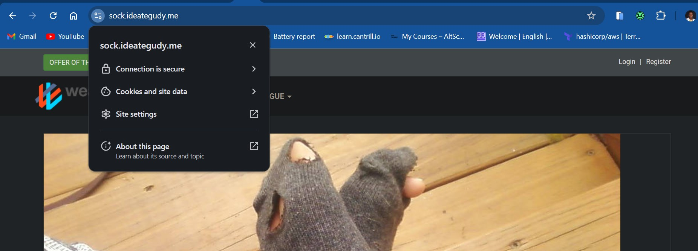
> Configuration files can be found in the ./k8s directory.

### 3. _Deploying Prometheus and Grafana_

I deployed Prometheus, grafana and alertmanager using helm

```
helm install prometheus prometheus-community/kube-prometheus-stack --namespace sock-shop --create-namespace
```

### 4. _Proof of Deployment_

You can access the application over HTTPS with certificates issued by Let’s Encrypt. The dashboards and monitoring tools (Prometheus and Grafana) can be accessed securely, demonstrating the successful deployment of a secure and scalable microservice application.
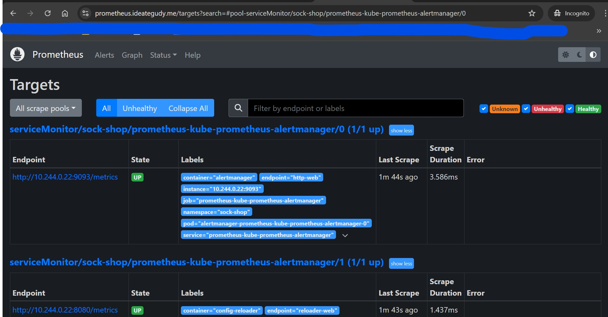
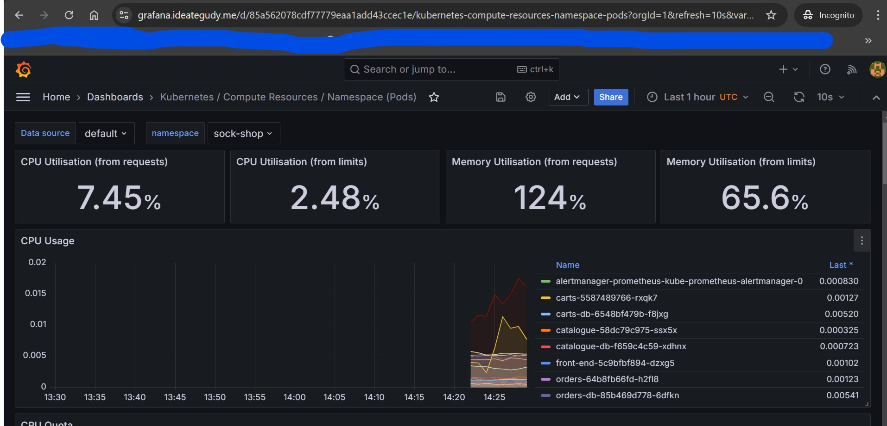
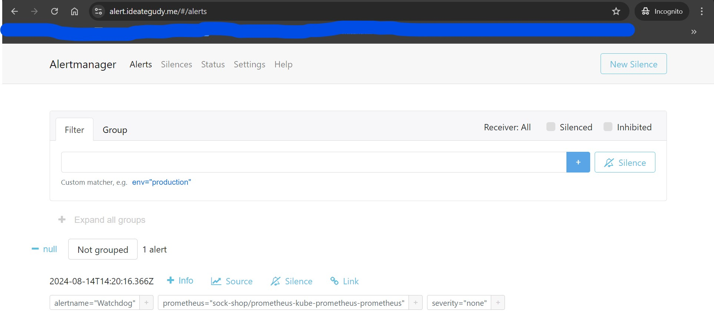

## Deployment Automation Using GitHub Actions

This project uses a GitHub Actions pipeline for fully automated deployment:

- _Setup AKS with Terraform._
- _Install Helm_
- _Install CertManager_
- _Deploy sockshop application._
- _Setup ingress-nginx Controller_
- _Deploy to Prometheus, Grafana for monitoring and Alert-Manager_
- _Issue certificate with Letsencrypt and Cert-Manager for HTTPS._

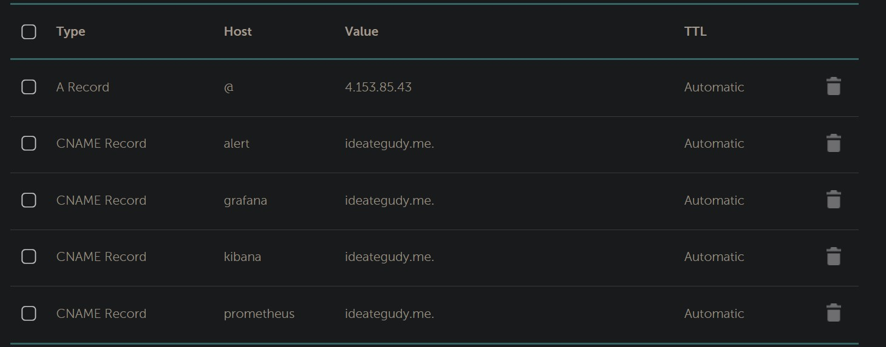
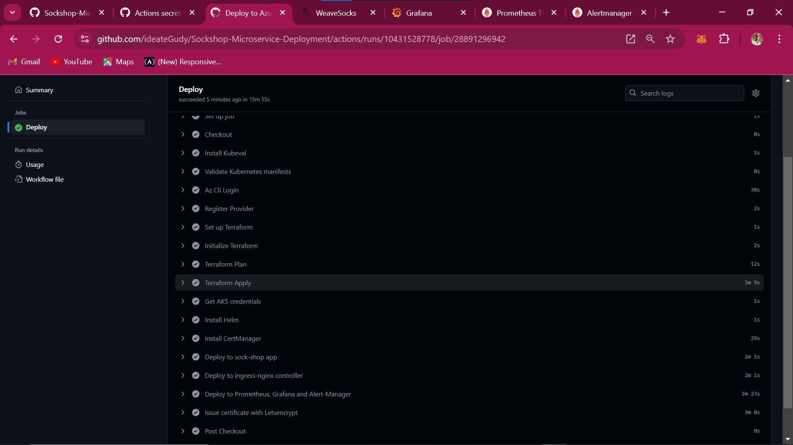
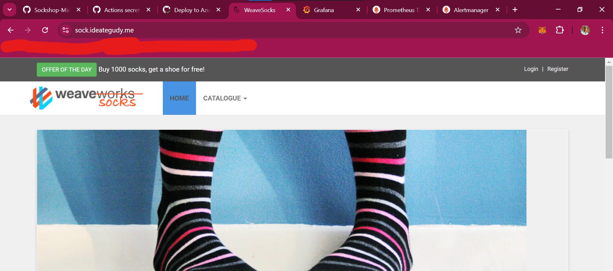

## Running the Deployment Locally

To deploy the entire stack locally by navigating to the ./k8s directory and use the provided bash scripts:

```bash
bash deploy-app.sh
```

---

---

> ##### There is still room for improvements.
>
> ##### i'll continue to work on this repo .....
