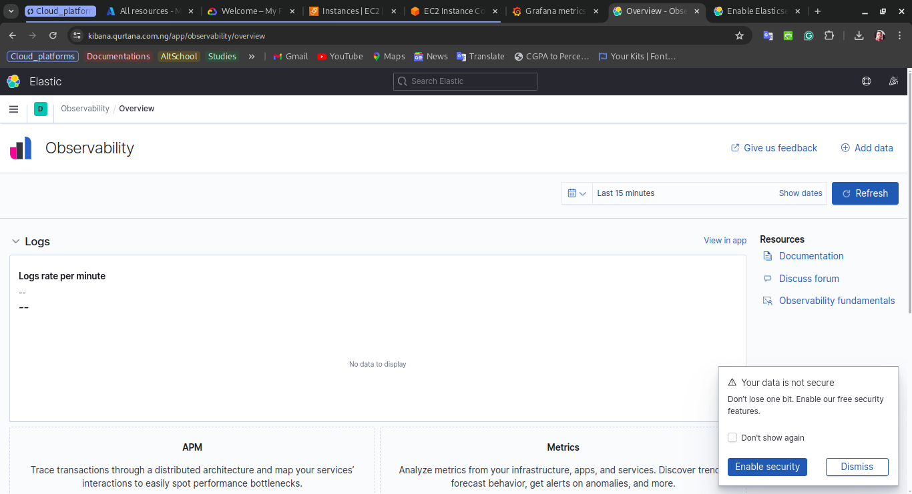

# ELK Stack Deployment on Azure Kubernetes Service (AKS)

This directory contains manifest files for deploying the ELK stack components to an Azure Kubernetes Service (AKS) cluster. The ELK stack components include:

- [Elasticsearch](https://www.elastic.co/elasticsearch/)
- [Logstash](https://www.elastic.co/logstash/)
- [Kibana](https://www.elastic.co/kibana/)
- [Filebeat](https://www.elastic.co/beats/filebeat/)

## Elasticsearch

The Elasticsearch instance is used to store the logs collected by Filebeat. It is configured with the necessary indices and mappings to manage the logs.

## Logstash

The Logstash instance collects logs from applications running in the Kubernetes cluster. It is configured with the necessary input, filter, and output plugins to gather, parse, and forward logs to Elasticsearch.

## Kibana

Kibana is used to visualize the logs collected by Filebeat and stored in Elasticsearch. It is configured with the required index patterns and visualizations for log analysis.

### Image of the Kibana Interface After Deployment

## Filebeat

Filebeat collects logs from applications running in the Kubernetes cluster and sends them to Logstash. It is set up with the necessary inputs and outputs to ensure logs are properly forwarded.

Together, these ELK stack components facilitate the collection, parsing, storage, and visualization of logs from applications running within the Kubernetes cluster.
